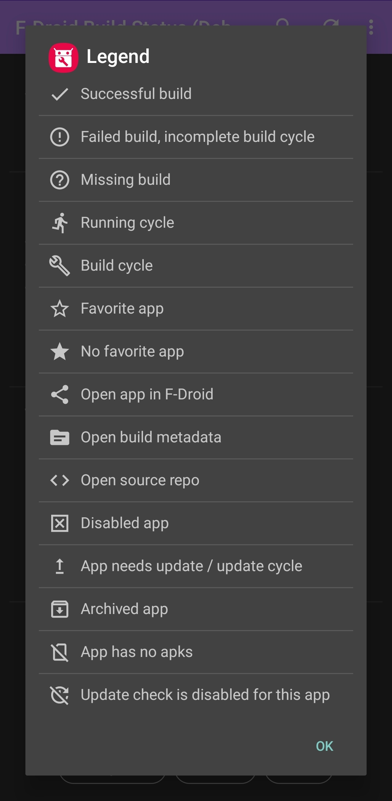

# </img> F-Droid Build Status

Android App to show and monitor the current F-Droid build status. It uses the F-Droid build server
API.

Get nightly builds
from <a href="https://fdroid.storchp.de/fdroid/repo?fingerprint=99985A7E73DCB0B16C9BDDCE7A0B4996F88068AE7C771ED53E217E69CD1FF196">https://fdroid.storchp.de/fdroid/repo</a>

## Features

- Shows successful, failed and missing builds
- Shows if an app needs an update, is disabled, archived, has no apk package or has disabled update
  check
- Shows published versions and highest metadata version of an app
- Shows build log
- Mark apps as favourite
- Notify about new build status, optionally only of your favourite apps

## F-Droid API

The App uses the following F-Droid API endpoints:

- **running.json**: the current running F-Droid buildserver
  process, https://f-droid.org/repo/status/running.json
- **build.json**: the last completed F-Droid buildserver build
  cycle, https://f-droid.org/repo/status/build.json
- **update.json**: the last update check of the F-Droid
  buildserver, https://f-droid.org/repo/status/update.json
- **build.log**: `https://f-droid.org/repo/{id}_{versionCode}.log.gz`
- **published package info**: `https://f-droid.org/api/v1/packages/{id}`,
  example https://f-droid.org/api/v1/packages/org.fdroid.fdroid

## Screenshots

    
    
    
    
    
    

## Legend

 currently running build cycle (
running.json)

 finished build cycle (build.json)

 successful build

 failed build, incomplete build cycle (
maxBuildTimeReached)

 missing build

 non-favourite app

 favourite app

 disabled app

 archived app

 app has no packages

 app has no update check enabled

 app needs update / update cycle

## Translations

This app is translated at: <a href="https://translate.codeberg.org/projects/f-droid_build_status/">
translate.codeberg.org</a>.

## Useful information

- [General F-Droid documentation page](https://f-droid.org/en/docs/)
- [F-Droid update processing](https://f-droid.org/en/docs/Update_Processing/)
- [How exactly does the building process work?](https://gitlab.com/fdroid/wiki/-/wikis/FAQ#how-exactly-does-the-building-process-work)
- [How long does it take for my app to show up on website and client?](https://gitlab.com/fdroid/wiki/-/wikis/FAQ#how-long-does-it-take-for-my-app-to-show-up-on-website-and-client)

## Artwork

- Logo derived from F-Droid: https://gitlab.com/fdroid/artwork
- Icons from: https://github.com/material-components/material-components
- Acryl painting from @mondstern: https://pixelfed.social/p/mondstern/254646998685323264 (many
  thanks  :heart_eyes:)

## Chat

If you would like to get in touch:

Matrix: `#fdroid-build-status:matrix.org` or
via [Element.io](https://app.element.io/#/room/#fdroid-build-status:matrix.org)

## Related Projects

- F-Droid Monitor: https://monitor.f-droid.org/builds
- fdroid-build-checker: https://github.com/johnjohndoe/fdroid-build-checker

